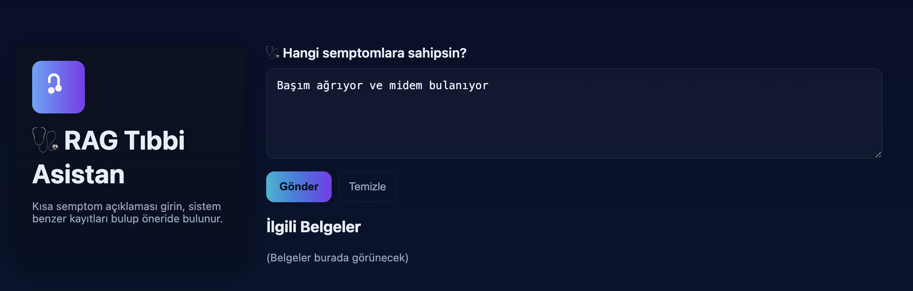
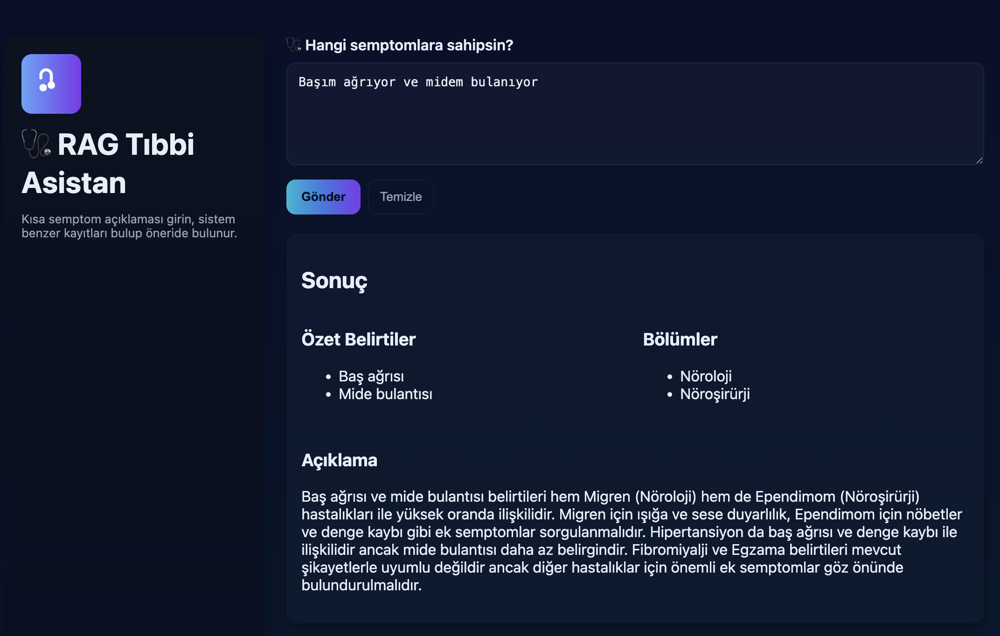
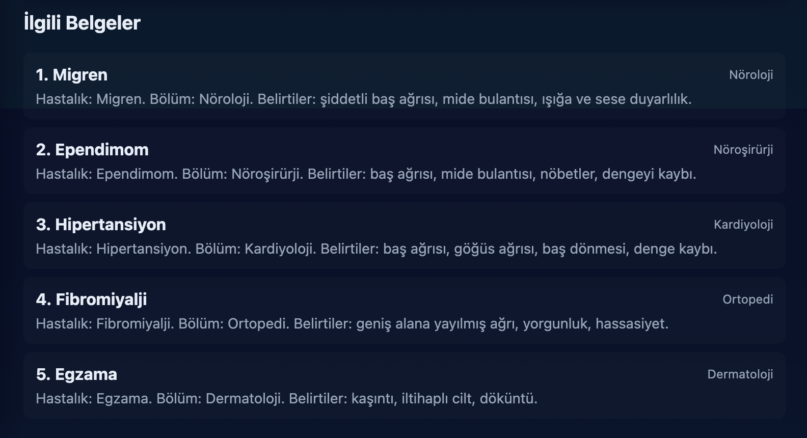

# RAG with OpenAI and FAISS

A medical symptom analysis application using Retrieval-Augmented Generation (RAG) with OpenAI and FAISS vector database. The system processes Turkish language symptoms using Zemberek NLP and provides medical recommendations.

## Screenshots

### Landing Page

The main interface where users can input their symptoms in Turkish.



### RAG Medical Assistant Output

The output from "RAG Tıbbi Asistan" displays comprehensive medical analysis including:
- **Sonuç** (Result) - Overall diagnosis recommendation
- **Özet Belirtiler** (Summary of Symptoms) - Key symptoms identified
- **Bölümler** (Departments) - Recommended medical departments to visit
- **Açıklama** (Explanation) - Detailed explanation of the diagnosis



### Probable Diseases

Shows the most probable diseases diagnosed by the RAG system with their main symptom definitions. This helps doctors see possible diseases based on the user's symptoms.



## System Requirements

- Docker installed
- Python 3.13.1 installed
- npm installed

## Setup Instructions

### 1. Virtual Environment Setup

Run the following commands at the **root directory**:

```bash
# Create virtual environment
python3 -m venv venv

# Activate virtual environment
source venv/bin/activate

# Install dependencies
pip install --upgrade pip && pip install -r requirements.txt
```

### 2. Install Frontend Dependencies

Navigate to the **frontend** directory and run:

```bash
cd frontend
npm install
cd ..
```

### 3. Configure Environment Variables

Create a `.env` file at the **root directory** by copying the content from `.env.example`:

```bash
cp .env.example .env
```

Then fill in the required values:
- `OPENAI_API_TOKEN` - Your OpenAI API key

## Running the Project

### Step 1: Start Zemberek Docker Container

Run the following command in a terminal:

```bash
docker run -d --rm -p 6789:6789 --name zemberek-grpc ryts/zemberek-grpc
```

### Step 2: Start the Backend Server

Navigate to **backend/src** directory and run:

```bash
cd backend/src

# Activate virtual environment (if not already activated)
source ../../venv/bin/activate

# Run the backend server
python3 ./web_app.py
```

**Note:** If port 5000 is already in use:
- On Linux/macOS: Kill processes using port 5000 with `lsof -ti:5000 | xargs kill -9`
- Or change the port in `web_app.py` file

### Step 3: Start the Frontend

Open a new terminal, navigate to **frontend** directory and run:

```bash
cd frontend
npm start
```

## Access the Application

🎉 **Congratulations!** You can now access the project at:

**http://localhost:3000**

## How to Use

1. Write your symptoms in **Turkish** in the input field
2. Click on the **"Gönder"** button
3. Wait for the response
4. The medical recommendation will be displayed in the output field

## Project Structure

```
.
├── backend/          # Backend application
│   └── src/         # Source code for RAG and web app
├── data/            # Dataset files
├── frontend/        # React frontend application
├── helpers/         # Utility scripts
├── faiss_index/     # FAISS vector database
└── requirements.txt # Python dependencies
```

## Technologies Used

- **OpenAI API** - Language model for generating responses
- **FAISS** - Vector similarity search
- **Zemberek** - Turkish NLP processing
- **Flask** - Backend API server
- **React** - Frontend user interface
