# RAG with OpenAI and FAISS

A medical symptom analysis application using Retrieval-Augmented Generation (RAG) with OpenAI and FAISS vector database. The system processes Turkish language symptoms using Zemberek NLP and provides medical recommendations.

## Screenshots and User Interface Guide

### Introduction

The RAG Tıbbi Asistan (Medical Assistant) System provides a comprehensive interface for both patients and medical professionals. The system allows patients to describe their symptoms and get intelligent department recommendations, while doctors can review patient information, AI-generated insights, and detailed diagnostic analysis.

### Main Landing Page

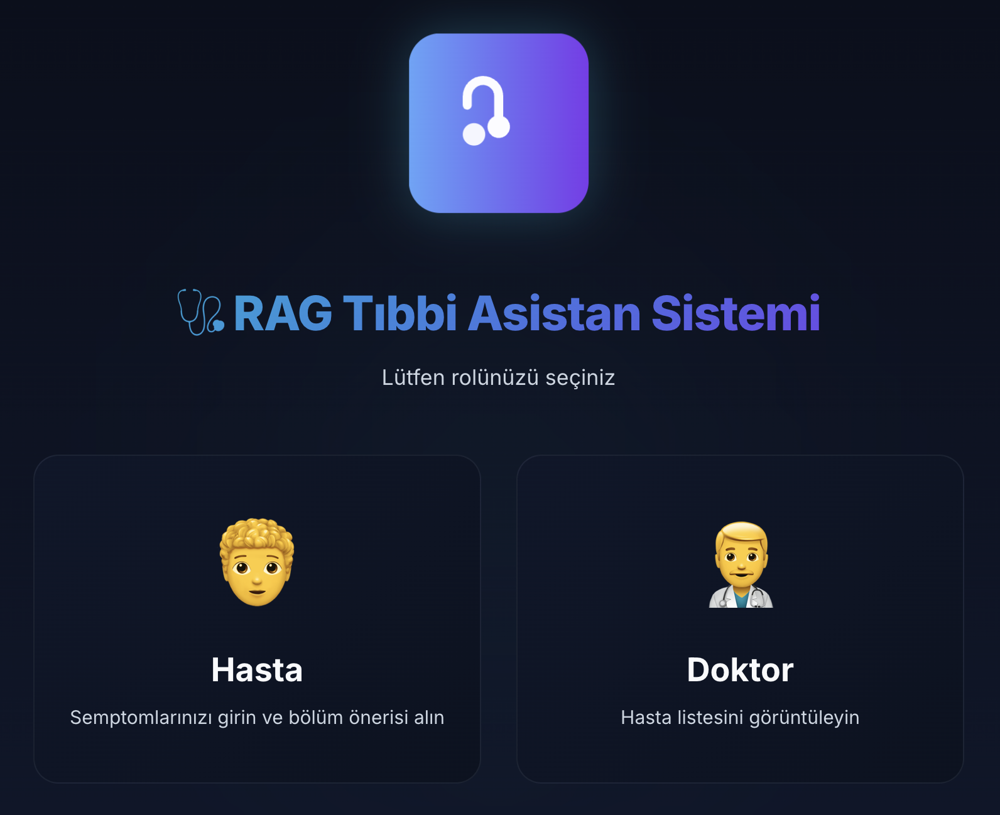

When users first access the application, they encounter the main interface titled "RAG Tıbbi Asistan Sistemi" (RAG Medical Assistant System). Here, users must choose their role in the system - either as a **Hasta** (Patient) or **Doktor** (Doctor). This role selection determines the workflow and features available to the user.

---

## Patient Side Workflow

### 1. Role Selection

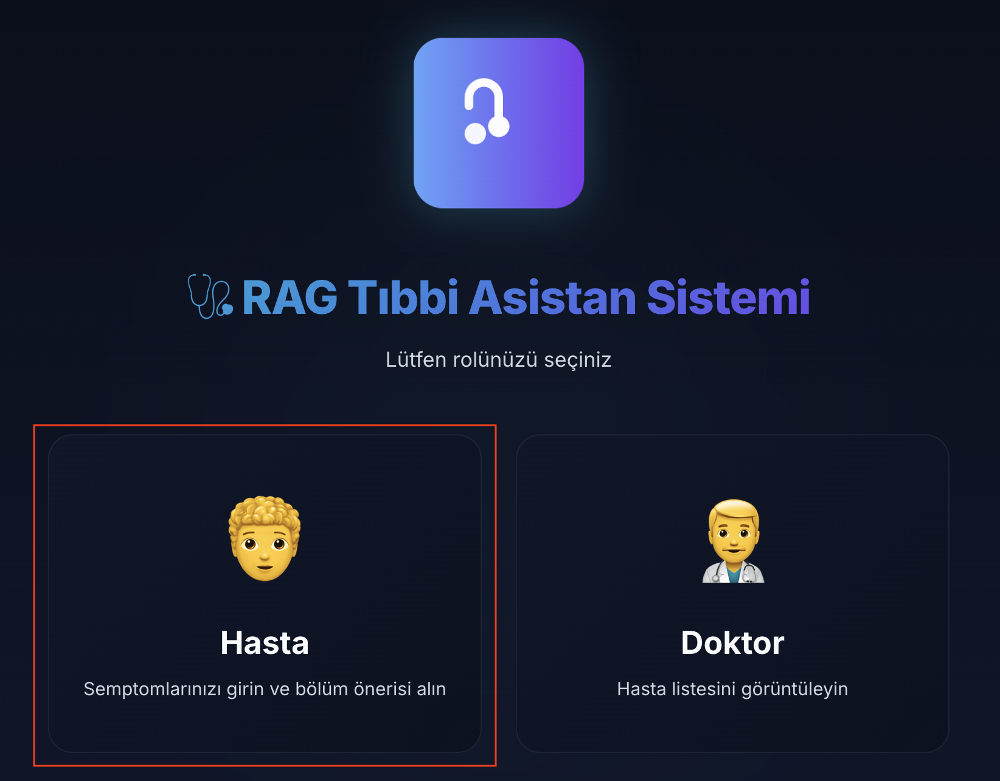

To access the patient interface, users select the "Hasta" (Patient) option from the main landing page. This navigates them to the patient-specific interface where they can describe their symptoms.

### 2. Patient Landing Page

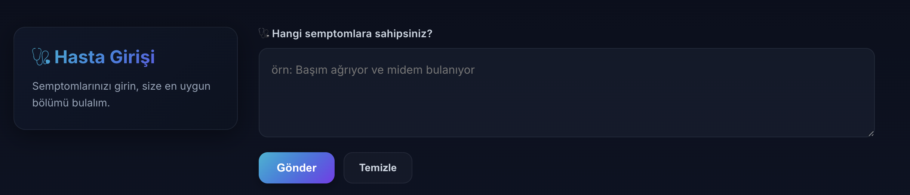

Upon entering the patient side, users are greeted with a clean interface that prompts them to input their symptoms. The text area displays the message "Belirtilerinizi buraya yazın..." (Write your symptoms here...), inviting patients to describe what they're experiencing in their own words in Turkish.

### 3. Entering Symptoms

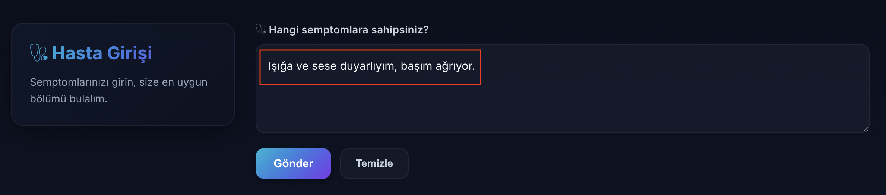

This screenshot shows an example of a patient entering their symptoms. In this case, the patient has written "Işığa ve sese duyarlıyım, başım ağrıyor." (I am sensitive to light and sound, my head hurts). After entering their symptoms, patients click the **"Gönder"** (Send) button to submit their information to the RAG system for analysis.

### 4. Initial Processing

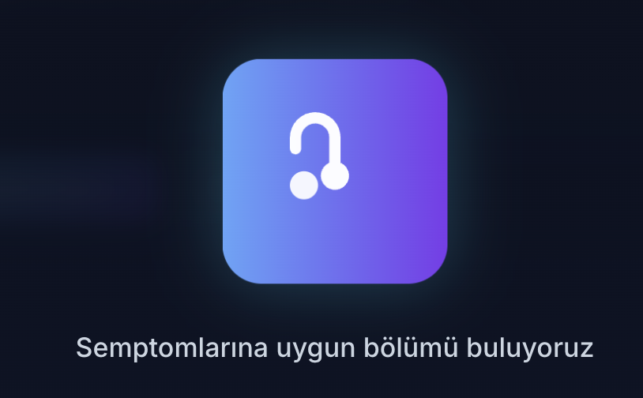

Immediately after clicking the send button, patients see a loading indicator. During this phase, the RAG system is processing the initial symptom description, performing semantic analysis, and preparing relevant follow-up questions to better understand the patient's condition.

### 5. Follow-up Questions

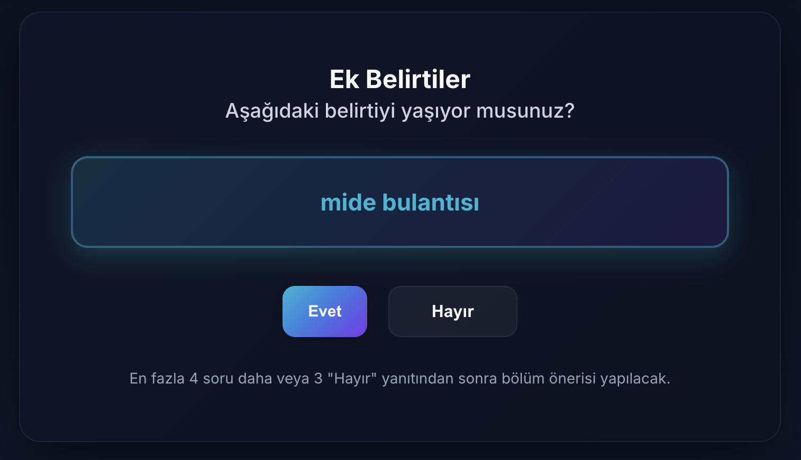

The system presents patients with additional questions to gather more specific information about their symptoms. These questions are dynamically generated based on the patient's initial input and may vary depending on what symptoms were described. The questions help the system narrow down the possible conditions and make more accurate department recommendations. Patients' answers to these questions further refine the diagnostic process, as the system adapts its analysis based on each response.

### 6. Final Processing

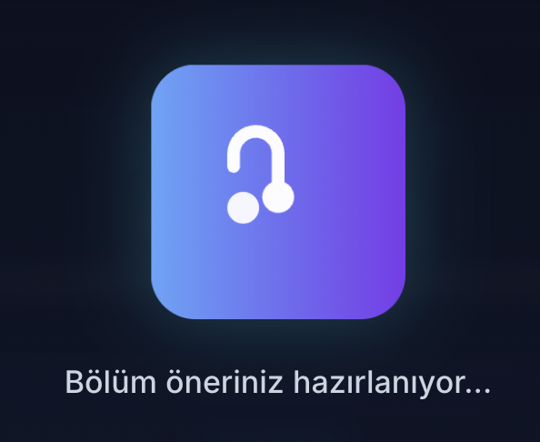

After answering the follow-up questions, patients see another loading indicator. At this stage, the RAG system is performing comprehensive analysis by combining all the patient's inputs and answers, calculating similarity scores using the FAISS vector database, applying hybrid scoring algorithms (70% semantic similarity + 30% token overlap), and determining the most appropriate medical department for the patient's condition.

### 7. Department Recommendation

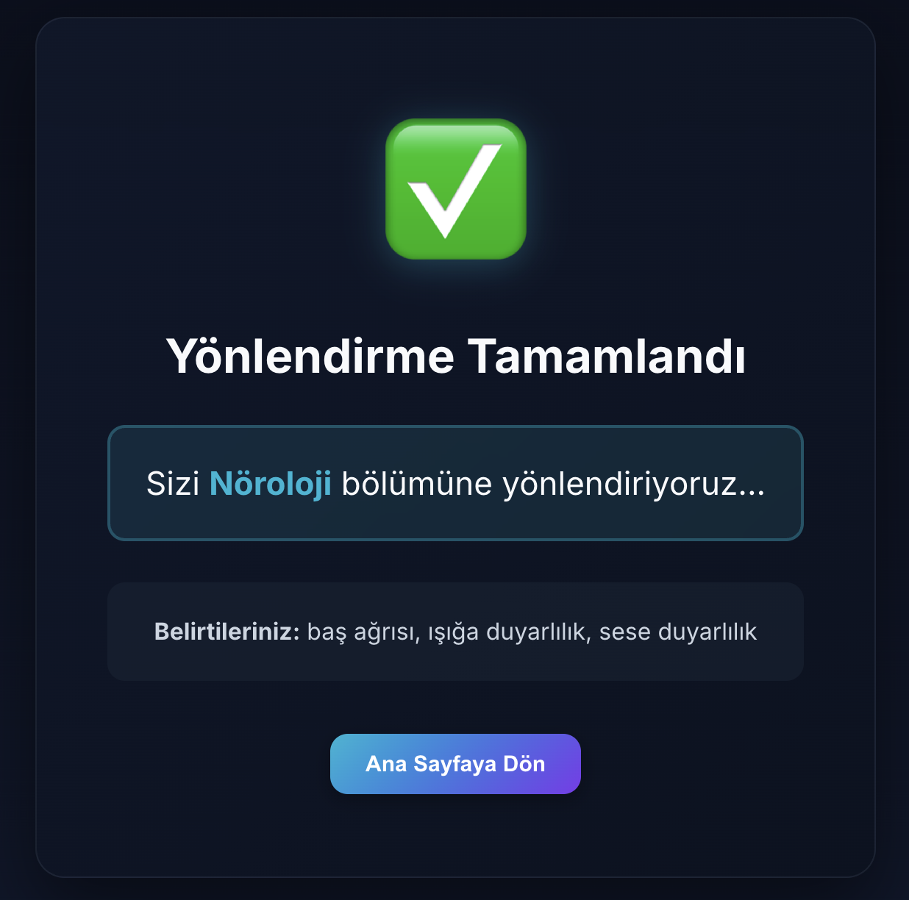

The final step displays the system's recommendation. Based on all the information gathered and analyzed through the RAG pipeline, the patient is directed to the appropriate medical department. The interface shows "Yönlendirildiğiniz bölüm:" (The department you are being directed to:) followed by the recommended department, such as "Nöroloji" (Neurology) in this example. This recommendation is generated by the intelligent combination of vector similarity search, hybrid scoring, and LLM-based reasoning.

---

## Doctor Side Workflow

### 8. Doctor Role Selection

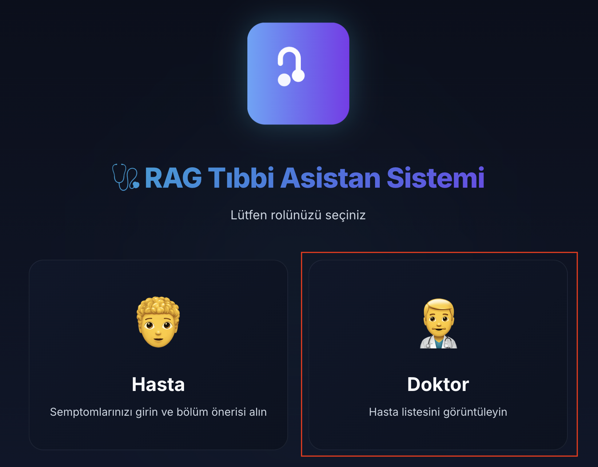

Representative department doctors access the system by selecting the "Doktor" (Doctor) option from the main landing page. This provides them with access to the doctor panel where they can review all patient cases and detailed diagnostic information.

### 9. Doctor Panel Overview

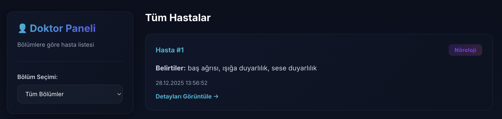

The doctor panel presents a comprehensive dashboard showing all patients who have used the system. Each patient card displays:
- **Patient ID**: Unique identifier (e.g., Hasta #1, #2, #3)
- **Symptoms Summary**: Brief overview of the patient's reported symptoms
- **Recommended Department**: The department that the RAG system has assigned based on analysis (e.g., Nöroloji, Kardiyoloji, İç Hastalıkları)
- **Date and Time**: When the patient submitted their symptoms

Doctors can click on any patient card to view detailed information and AI-generated diagnostic insights for that specific case.

### 10. Patient Detail - Detected Symptoms & Alternative Departments


When a doctor selects a patient, the first section shows:
- **Detected Final Symptoms** (Son Tespit Edilen Belirtiler): A refined list of the patient's symptoms after NLP processing, lemmatization with Zemberek, and semantic analysis
- **Suggested Other Departments** (Önerilen Diğer Bölümler): Alternative medical departments that might also be relevant to the patient's condition, providing doctors with additional options if the primary recommendation doesn't fully align with their clinical assessment

### 11. Patient Detail - Additional Questions for Doctor

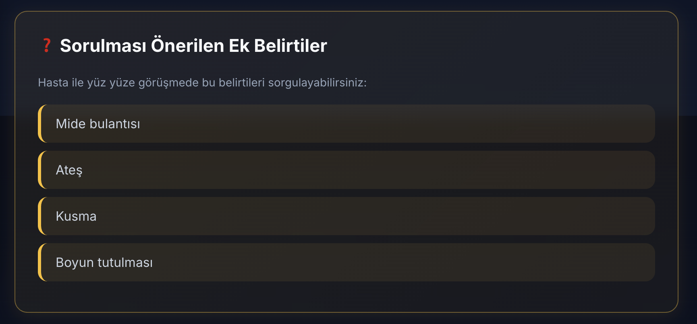

This section provides doctors with intelligent, context-aware questions (Doktorun Hastaya Sorabileceği Sorular) that they can ask the patient during consultation. These questions are generated by the LLM based on the patient's symptoms and help doctors:
- Gather more specific information about the condition
- Differentiate between similar diagnoses
- Make a more accurate final diagnosis
- Conduct a more thorough examination

### 12. Patient Detail - Disease Probabilities

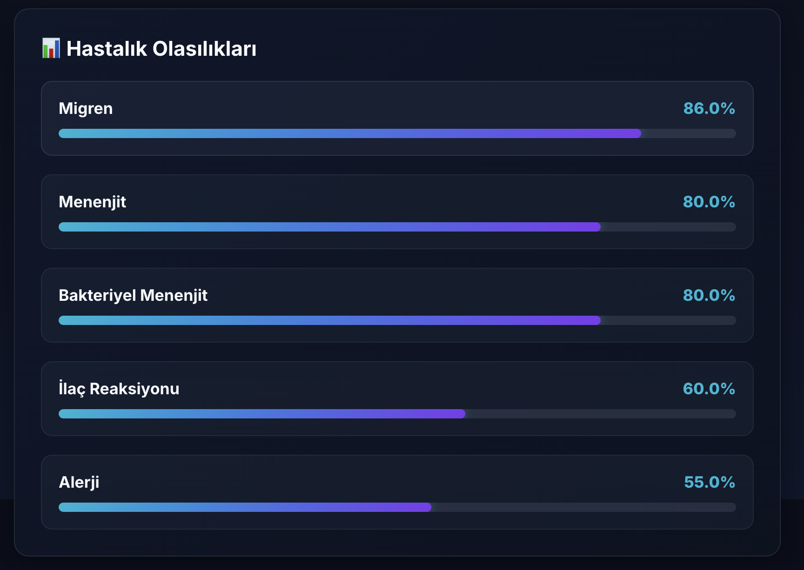

The system displays calculated disease possibilities (Hastalık Olasılıkları) with their associated scores. This section shows:
- **Disease Names**: Potential conditions matching the symptoms
- **Probability Scores**: Calculated using the hybrid scoring system (combining semantic similarity from the multilingual-E5-base model with token overlap metrics)
- **Ranking**: Diseases are ordered by their likelihood scores

This provides doctors with a data-driven view of the most probable diagnoses based on the RAG system's analysis of the symptom vector database.

### 13. Patient Detail - AI-Generated Medical Explanation

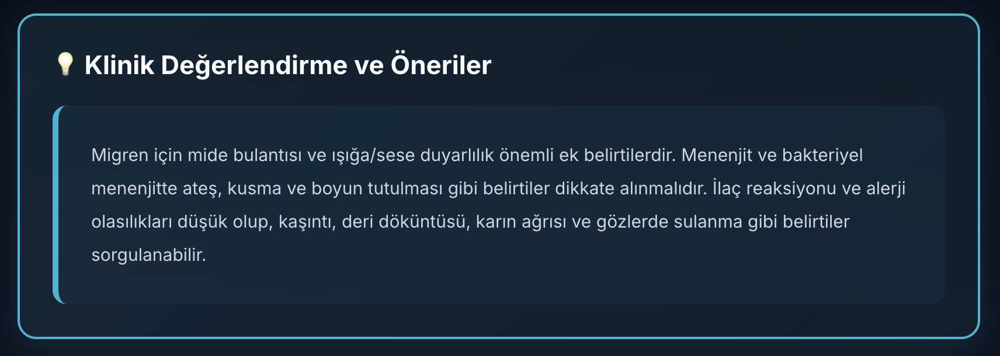

Since the system has comprehensive knowledge of the patient's symptoms and the detected diseases through hybrid scoring and vector similarity search, the LLM (GPT-4) generates a detailed, human-readable explanation (Açıklama) for the doctor. This narrative output includes:
- Clinical interpretation of the symptoms
- Reasoning behind the department recommendation
- Potential diagnostic considerations
- Suggested approaches for patient care

This transforms the raw data and scores into actionable medical insights that doctors can use in their clinical decision-making process.

### 14. Patient Detail - RAG Retrieved Documents

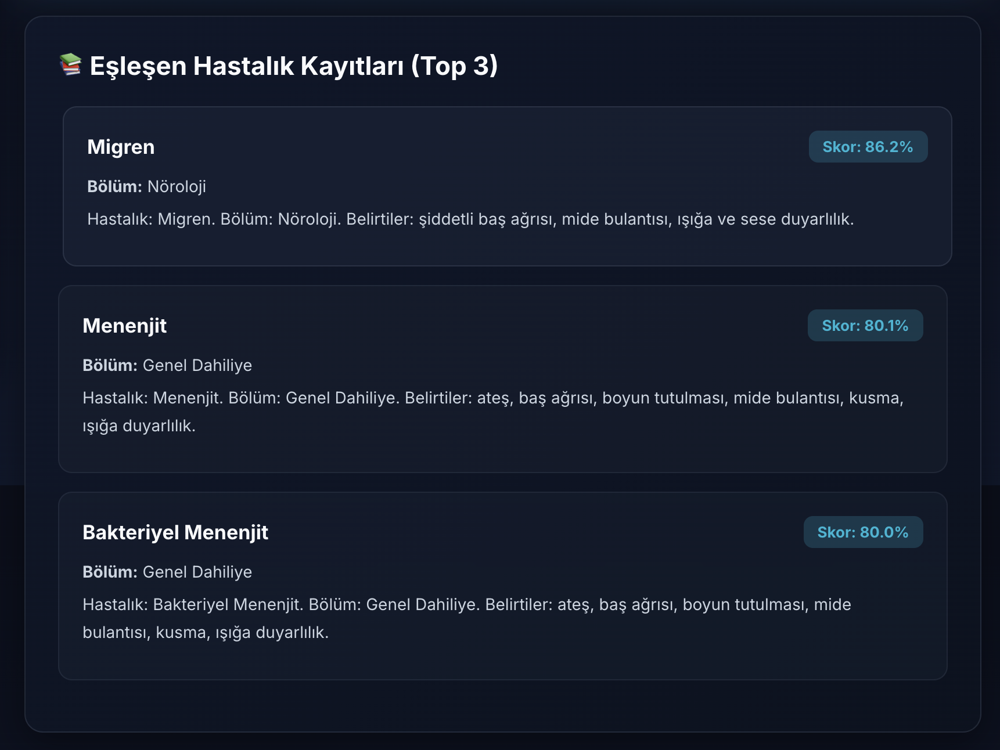

The final section displays the actual database records (Bulunan Kayıtlar) that were retrieved by the RAG system using the k-nearest neighbors algorithm with FAISS. Each record shows:
- **Disease Information**: Complete disease entries from the medical database
- **Symptom Descriptions**: Detailed symptom profiles associated with each disease
- **Similarity Scores**: How closely each record matches the patient's symptoms

This transparency allows doctors to see exactly which medical knowledge entries the AI system used to make its recommendations, providing full traceability and enabling doctors to validate the AI's reasoning process.

## System Requirements

- Docker installed
- Python 3.13.1 installed
- npm installed

## Setup Instructions

### 1. Virtual Environment Setup

Run the following commands at the **root directory**:

```bash
# Create virtual environment
python3 -m venv venv

# Activate virtual environment
source venv/bin/activate

# Install dependencies
pip install --upgrade pip && pip install -r requirements.txt
```

### 2. Install Frontend Dependencies

Navigate to the **frontend** directory and run:

```bash
cd frontend
npm install
cd ..
```

### 3. Configure Environment Variables

Create a `.env` file at the **root directory** by copying the content from `.env.example`:

```bash
cp .env.example .env
```

Then fill in the required values:
- `OPENAI_API_TOKEN` - Your OpenAI API key

## Running the Project

### Step 1: Start Zemberek Docker Container

Run the following command in a terminal:

```bash
docker run -d --rm -p 6789:6789 --name zemberek-grpc ryts/zemberek-grpc
```

### Step 2: Start the Backend Server

Navigate to **backend/src** directory and run:

```bash
cd backend/src

# Activate virtual environment (if not already activated)
source ../../venv/bin/activate

# Run the backend server
python3 ./web_app.py
```

**Note:** If port 5000 is already in use:
- On Linux/macOS: Kill processes using port 5000 with `lsof -ti:5000 | xargs kill -9`
- On Windows: Kill processes using port 5000 with `netstat -ano | findstr :5000` (find PID) then `taskkill /PID <PID> /F`
- Or change the port in `web_app.py` file

### Step 3: Start the Frontend

Open a new terminal, navigate to **frontend** directory and run:

```bash
cd frontend
npm start
```

## Access the Application

🎉 **Congratulations!** You can now access the project at:

**http://localhost:3000**

## How to Use

1. Write your symptoms in **Turkish** in the input field
2. Click on the **"Gönder"** button
3. Wait for the response
4. The medical recommendation will be displayed in the output field

## Project Structure

```
.
├── backend/              # Backend application
│   ├── config.yaml      # Backend configuration file
│   ├── assets/          # Backend assets
│   │   ├── stopwords.txt      # Turkish stopwords list
│   │   └── symptoms.json      # Symptoms database
│   ├── data/            # Backend data storage
│   │   └── vector/      # Vector database storage
│   │       └── disease_faiss.index  # FAISS index file
│   └── src/             # Source code for RAG and web app
│       ├── config_loader.py      # Configuration loader
│       ├── rag_openai.py         # RAG implementation with OpenAI
│       ├── web_app.py            # Flask web application
│       └── zemberek_client.py    # Zemberek NLP client
├── data/                # Original dataset files
│   ├── hastalik_with_text.csv       # Disease data with descriptions
│   ├── hastalk.csv                  # Raw disease data
│   └── chore/           # Data processing results
│       ├── disease_department_lookup.csv
│       ├── distinct_diseases.json
│       └── hastalik_with_department.csv
├── frontend/            # React frontend application
│   ├── package.json    # Frontend dependencies
│   ├── build/          # Production build
│   ├── public/         # Public assets
│   └── src/            # React source code
│       ├── App.js           # Main application component
│       ├── PatientView.js   # Patient interface
│       └── DoctorView.js    # Doctor interface
├── helpers/             # Utility scripts for data processing
│   ├── create_vector_database.py      # FAISS index creation
│   ├── generate_text_column.py        # Data preprocessing
│   ├── department_matching_script.py  # Department mapping
│   └── test_rag_call.py               # RAG testing
├── images/              # UI screenshots for documentation
├── faiss_index/         # Legacy FAISS vector database
└── requirements.txt     # Python dependencies
```

## Technologies Used

### Backend
- **Python 3.13.1** - Core programming language
- **OpenAI GPT-4** - Large Language Model for medical analysis and response generation
- **FAISS (Facebook AI Similarity Search)** - High-performance vector database for semantic similarity search
- **Sentence Transformers** - `intfloat/multilingual-e5-base` model for generating text embeddings
- **Zemberek NLP** - Turkish language processing (lemmatization, morphological analysis)
- **Flask** - Web framework for REST API
- **Docker** - Containerization for Zemberek gRPC service

### Frontend
- **React** - User interface framework
- **Node.js & npm** - JavaScript runtime and package manager

### Data Processing
- **Pandas** - Data manipulation and preprocessing
- **NumPy** - Numerical computations
- **Pickle** - Metadata serialization

### Natural Language Processing
- **Multilingual-E5-Base** - 768-dimensional sentence embeddings supporting 100+ languages including Turkish
- **Snowball Stemmer** - Turkish text normalization
- **Custom Hybrid Scoring** - 70% semantic similarity + 30% token overlap for retrieval optimization

### Architecture
- **RAG (Retrieval-Augmented Generation)** - Combines vector search with LLM for context-aware responses
- **Vector Database** - FAISS index with ~1000 medical records
- **gRPC** - Communication protocol for Zemberek service
